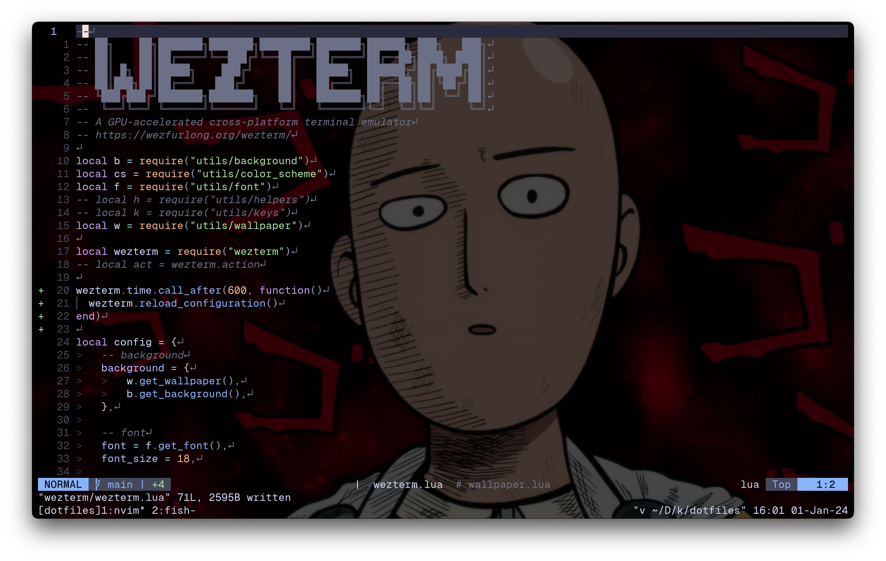

# My dev configs



Install requirements:
```
brew install neovim tmux fish startship alacritty zoxide koekeishiya/formulae/skhd koekeishiya/formulae/yabai fzf ripgrep
```

To disable desktop rearrangement:
```
defaults write com.apple.dock "mru-spaces" -bool "false" && killall Dock
```
To enable desktop rearrangement:
```
defaults write com.apple.dock "mru-spaces" -bool "true" && killall Dock
```

To disable Dock (delay 1000s):
```
defaults write com.apple.dock autohide-delay -float 1000; killall Dock
```
To restore default behavior:
```
defaults delete com.apple.dock autohide-delay; killall Dock
```
